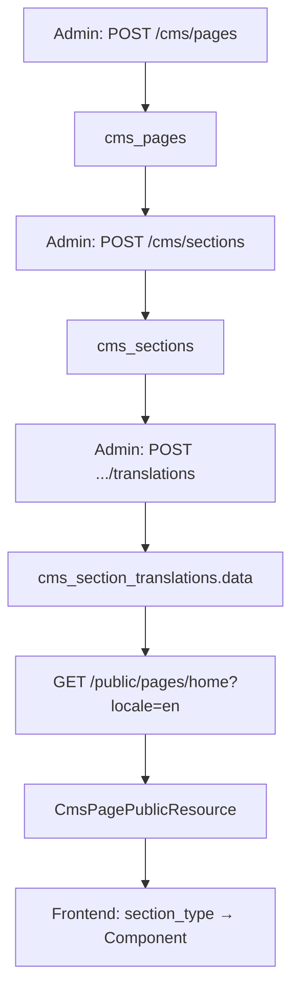

# Headless JSONB CMS Architecture

Production-grade section-based page builder aligned with Strapi, Contentful, Builder.io, and Sanity patterns.

**API reference:** [cms-api-v1.md](./cms-api-v1.md)

---

## Design principles

| Principle | Implementation |
|-----------|----------------|
| Minimal pages | `cms_pages` stores only `key`, `status`, audit columns |
| Dynamic sections | `section_type` + `section_key` — no fixed content columns |
| Flexible content | All translatable fields in `cms_section_translations.data` (JSONB) |
| Frontend-owned UI | Layout, styling, and variants live in React/Next.js/Vue — not in the API |
| No schema migrations for new fields | Extend `data` JSON + frontend types; never add static DB columns |

---

## Database schema

### `cms_pages`

| Column | Type | Notes |
|--------|------|-------|
| `id` | bigint | PK |
| `key` | string | Unique API identifier (`home`, `about`) |
| `status` | boolean | Published flag |
| `created_by`, `updated_by` | FK → users | Nullable |
| `timestamps` | | |

### `cms_sections`

| Column | Type | Notes |
|--------|------|-------|
| `id` | bigint | PK |
| `cms_page_id` | FK | Cascade delete |
| `section_key` | string | Unique per page (`hero_main`, `faq_primary`) |
| `section_type` | string | Frontend component key (`hero`, `faq`, `pricing`) |
| `sort_order` | unsigned int | Display order |
| `is_active` | boolean | Toggle without deleting content |
| `timestamps` | | |

### `cms_section_translations`

| Column | Type | Notes |
|--------|------|-------|
| `id` | bigint | PK |
| `cms_section_id` | FK | Cascade delete |
| `locale` | string(5) | `en`, `es`, … |
| `data` | **jsonb** | All translatable content |
| `timestamps` | | |

**Unique:** `(cms_section_id, locale)`

---

## Why JSONB for `data`

- Each `section_type` has a different shape (hero vs FAQ vs pricing).
- PostgreSQL JSONB is binary-encoded, indexable (GIN), and supports nested objects and arrays.
- New marketing fields ship in application code and admin UI — **no `ALTER TABLE`**.
- Same pattern as modern headless CMS products: schema in the app, content in flexible JSON.

**Never add static columns** like `title`, `subtitle`, or `content` again. Everything translatable belongs in `data`.

---

## Why translations are separated

- **Sections** define structure: which block, what type, display order, active flag.
- **Translations** define locale-specific copy and structured content.
- One row per `(section, locale)` with a unique constraint — simple upserts and predictable cache keys.
- Fallback locale (`config/localization.php`) is applied when a translation is missing.

---

## Why sections are dynamic

- `section_type` → frontend component registry (`hero` → `<HeroSection />`).
- `section_key` → multiple instances of the same type on one page (`hero_main`, `hero_secondary`).
- Reorder via `sort_order`; hide via `is_active` without losing content.

---

## PostgreSQL indexes

```sql
-- cms_pages
CREATE INDEX cms_pages_status_idx ON cms_pages (status);

-- cms_sections
CREATE UNIQUE INDEX cms_sections_page_section_key_unique
  ON cms_sections (cms_page_id, section_key);
CREATE INDEX cms_sections_page_active_sort_idx
  ON cms_sections (cms_page_id, is_active, sort_order);
CREATE INDEX cms_sections_section_type_idx ON cms_sections (section_type);

-- cms_section_translations
CREATE UNIQUE INDEX cms_section_translations_section_locale_unique
  ON cms_section_translations (cms_section_id, locale);
CREATE INDEX cms_section_translations_locale_idx
  ON cms_section_translations (locale);
CREATE INDEX cms_section_translations_data_gin
  ON cms_section_translations USING GIN (data);
```

### JSONB query examples

```sql
-- English hero sections containing a specific headline
SELECT s.*
FROM cms_sections s
JOIN cms_section_translations t ON t.cms_section_id = s.id
WHERE t.locale = 'en'
  AND s.section_type = 'hero'
  AND t.data @> '{"headline": "Expert Bankruptcy Guidance You Can Trust"}';

-- FAQ translations with items array
SELECT *
FROM cms_section_translations
WHERE locale = 'en'
  AND data ? 'items';
```

---

## Architecture flow



### Step 1 — Page creation

```
POST /api/v1/cms/pages
{ "key": "home", "status": true }
```

Creates a shell in `cms_pages`. No content columns.

### Step 2 — Section creation

```
POST /api/v1/cms/sections
{
  "cms_page_id": 1,
  "section_key": "hero_main",
  "section_type": "hero",
  "sort_order": 0,
  "is_active": true
}
```

### Step 3 — Translation storage

```
POST /api/v1/cms/sections/{id}/translations
{
  "locale": "en",
  "data": {
    "headline": "...",
    "cta": { "label": "...", "href": "/contact" }
  }
}
```

Repeat for each supported locale (`en`, `es`, …).

### Step 4 — Public API

```
GET /api/v1/public/pages/home?locale=en
```

`CmsPageService` loads the published page, active sections (ordered), and locale translation with fallback.

### Step 5 — Frontend rendering

```tsx
const SECTION_REGISTRY: Record<string, React.ComponentType<{ data: unknown }>> = {
  hero: HeroSection,
  faq: FaqSection,
  pricing: PricingSection,
};

export function CmsPageRenderer({ payload }: { payload: CmsPagePayload }) {
  return (
    <>
      {payload.sections.map((section) => {
        const Component = SECTION_REGISTRY[section.section_type];
        if (!Component) return null;
        return <Component key={section.section_key} data={section.data} />;
      })}
    </>
  );
}
```

Vue, Next.js App Router, and mobile apps use the same contract: `section_type` → component, `data` → props.

### Step 6 — Multilingual handling

- Query `?locale=es` or rely on `set.locale` middleware.
- `CmsPageService` eager-loads requested locale + fallback (`en`).
- Missing `es` translation → returns `en` `data` automatically.

---

## Public API response shape

```json
{
  "status": true,
  "message": "CMS page loaded",
  "data": {
    "page": "home",
    "locale": "en",
    "sections": [
      {
        "section_key": "hero_main",
        "section_type": "hero",
        "sort_order": 0,
        "data": {}
      }
    ]
  }
}
```

No `settings` or `styles` — presentation is entirely frontend-driven.

---

## Example `data` schemas by section type

### Hero (`section_type: "hero"`)

```json
{
  "headline": "Expert Bankruptcy Guidance You Can Trust",
  "subheadline": "Protect your assets and rebuild your financial future.",
  "cta": {
    "label": "Free Consultation",
    "href": "/contact",
    "variant": "primary"
  },
  "media": {
    "type": "image",
    "src": "/assets/hero-home.jpg",
    "alt": "Attorney meeting with client"
  }
}
```

### FAQ (`section_type: "faq"`)

```json
{
  "title": "Frequently Asked Questions",
  "items": [
    {
      "id": "faq-1",
      "question": "How long does bankruptcy take?",
      "answer": "Chapter 7 typically completes in 3–6 months; Chapter 13 spans 3–5 years."
    },
    {
      "id": "faq-2",
      "question": "Will I lose my home?",
      "answer": "Exemption laws may protect your primary residence depending on equity and chapter filed."
    }
  ]
}
```

### Pricing (`section_type: "pricing"`)

```json
{
  "title": "Transparent Legal Plans",
  "subtitle": "Choose the level of support that fits your situation.",
  "plans": [
    {
      "id": "plan-basic",
      "name": "Essential",
      "price": { "amount": 999, "currency": "USD", "period": "flat" },
      "features": ["Initial consultation", "Document review", "Filing preparation"],
      "highlighted": false,
      "cta": { "label": "Get Started", "href": "/contact?plan=essential" }
    },
    {
      "id": "plan-plus",
      "name": "Full Representation",
      "price": { "amount": 2499, "currency": "USD", "period": "flat" },
      "features": ["Everything in Essential", "Court representation", "Creditor communication"],
      "highlighted": true,
      "cta": { "label": "Most Popular", "href": "/contact?plan=full" }
    }
  ]
}
```

These shapes are conventions — the API accepts any valid JSON object in `data`.

---

## Response caching

Public routes use `ResponseCacheMiddleware` (Redis, 1 hour TTL).

- Cache keys include a **version** from `PublicResponseCacheService`.
- Version bumps automatically via model observers on `CmsPage`, `CmsSection`, `CmsSectionTranslation`.
- Manual bust: `php artisan cache:clear` or bump via tinker (see [cms-api-v1.md](./cms-api-v1.md#cache-behaviour)).

---

## Migrations

| File | Purpose |
|------|---------|
| `2026_05_15_113253_create_cms_pages_table.php` | Pages table |
| `2026_05_15_113412_create_cms_sections_table.php` | Sections (no settings/styles) |
| `2026_05_15_113511_create_cms_section_translations_table.php` | `data` JSONB + GIN index |
| `2026_05_19_100000_refactor_cms_to_jsonb_headless_architecture.php` | Legacy → JSONB refactor |
| `2026_05_19_120000_remove_settings_and_styles_from_cms_sections.php` | Drop settings/styles columns |

```bash
php artisan migrate
php artisan db:seed --class=CmsSectionSeeder
```

---

## Laravel codebase map

| Layer | Location |
|-------|----------|
| Models | `app/Models/CmsPage.php`, `CmsSection.php`, `CmsSectionTranslation.php` |
| Service | `app/Services/CMS/CmsPageService.php` |
| Public resources | `app/Http/Resources/CmsPagePublicResource.php`, `CmsSectionPublicResource.php` |
| Admin resources | `CmsPageAdminResource.php`, `CmsSectionAdminResource.php`, `CmsSectionTranslationResource.php` |
| Form requests | `app/Http/Requests/Cms/*` |
| Admin controllers | `app/Http/Controllers/Api/Admin/Cms*Controller.php` |
| Public controller | `app/Http/Controllers/Api/Public/CmsPageController.php` |
| Cache invalidation | `app/Services/Cache/PublicResponseCacheService.php`, `app/Observers/ClearsPublicResponseCacheObserver.php` |
| Routes | `routes/api/v1/cms.php`, `routes/api/v1/public.php` |
| Locales | `config/localization.php` |

---

## Traditional CMS vs this architecture

| Traditional CMS | Headless JSONB CMS |
|-----------------|-------------------|
| Add `pricing_tiers` column → migration | Add `plans` array inside `data` |
| New section type → alter table | New `section_type` string + frontend component |
| Per-locale columns duplicated | One `data` document per locale |
| Styling in CMS DB | Styling in frontend design system |
